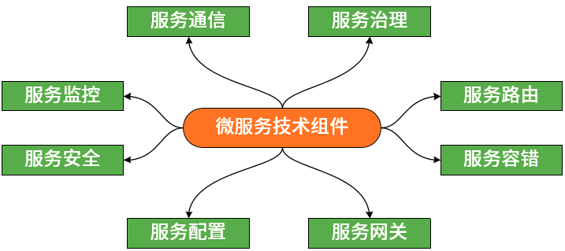
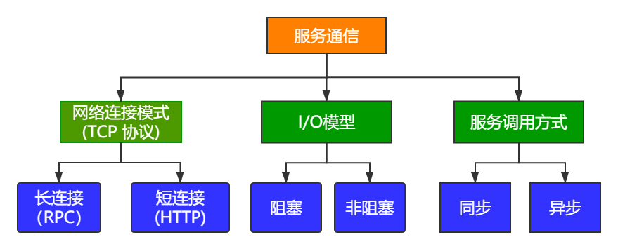
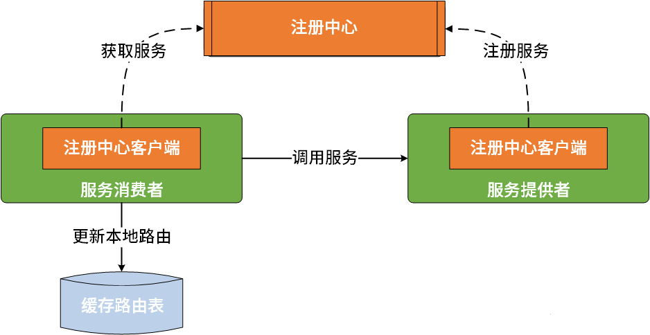
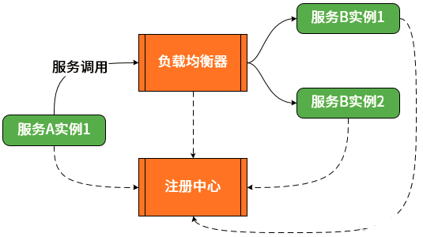
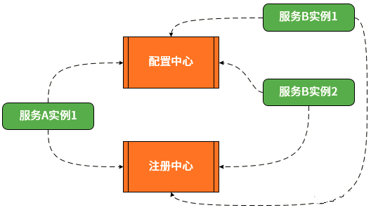
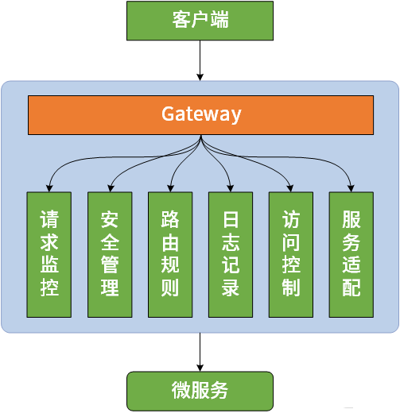
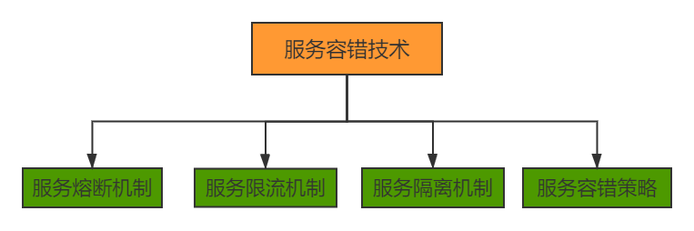
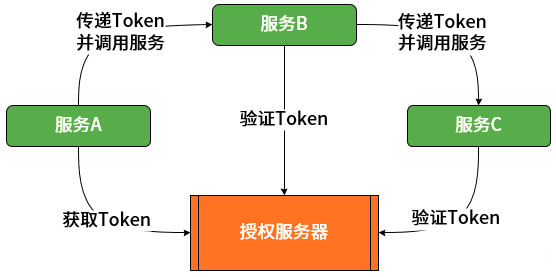
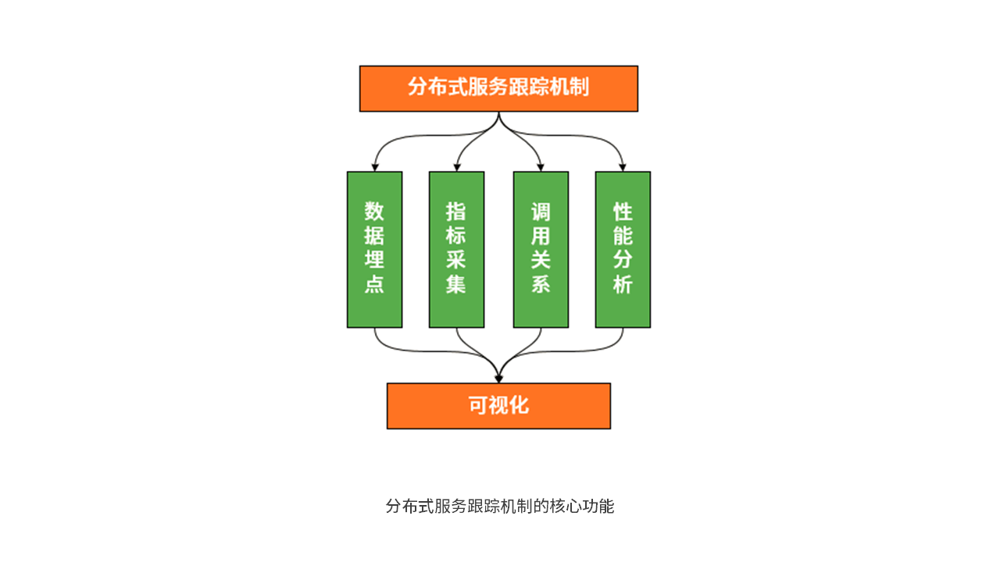

# 微服务组件介绍

基于目前业界主流的微服务实现技术提炼了八大技术体系，包括服务通信、服务治理、服务路由、服务容错、服务网关、服务配置、服务安全和服务监控，如下图所示。

上图中的每个技术体系都非常重要，下面来对它们分别展开介绍。

## 一、服务通信

网络通信是任何分布式系统的基础组件。网络通信本身涉及面很广，相对比较复杂，对于微服务架构而言，我们关注的是网络连接模式、I/O 模型和服务调用方式。

基于TCP协议的网络连接有两种基本方式，也就是通常所说的长连接和短连接。长连接和短连接的产生在于client和server采取的关闭策略，具体的应用场景采用具体的策略。在微服务架构中，dubbo 框架采用的是长连接rpc方式，openfeign采用短连接http方式。

I/O 模型也有阻塞式 I/O 和非阻塞式 I/O 等多种实现方式。阻塞式 I/O 实现简单，而非阻塞式 I/O 的性能更好。在微服务架构中，以服务网关而言，像Netflix 的 Zuul就是阻塞式 I/O，而Spring 自研的 Spring Cloud Gateway则采用的是非阻塞式 I/O。

服务调用方式，也会有同步和异步调用两种方式。在微服务架构中，通常会采用异步转同步的实现机制，也就是说开发人员使用同步的方式进行方法调用，而框架本身会基于 Future 等机制实现异步的远程处理。

其他通信还可能基于消息通信、事件驱动的通信，有兴趣可以去了解。

## 二、服务治理

在微服务架构中，服务治理可以说是最为关键的一个技术组件，因为各个微服务需要通过服务治理实现自动化的注册和发现。如果尝试着用手动的方式来给每一个客户端来配置所有服务提供者的服务列表是一件非常困难的事，而且也不利于服务的动态扩缩容、健康检查等。

服务注册中心是保存服务调用所需的路由信息的存储仓库，也是服务提供者和服务消费者进行交互的媒介，充当着服务注册和发现服务器的作用。诸如 Dubbo、Spring Cloud 等主流的微服务框架都基于 Zookeeper、Eureka、Nacos 等分布式系统协调工具构建了服务注册中心。后续我们会对Nacos的服务注册、发现进行原理分析。

## 三、服务路由

当我们服务基于服务注册中心构建一个多台集群化的服务时，当客户端请求到达集群，如何确定由哪一台服务器进行请求响应呢？这就是服务路由问题。在Spring Cloud中，采用负载均衡是一种比较常见的路由方案，常见的客户端/服务器端负载均衡技术都可以完成服务路由。Spring Cloud 主要内置了 Ribbon 等客户端负载均衡组件。具体需要了解几种负载均衡算法，如何配置不同的负载均衡策略。

## 四、服务配置

在微服务架构中，配置中心也是微服务架构中的基础组件。其目的也是对服务配置信息进行统一管理。

为了满足以上要求，配置中心通常需要依赖分布式协调机制，即通过一定的方法确保配置信息在分布式环境中的各个服务中能得到实时、一致的管理。可以采用诸如 Zookeeper 等主流的开源分布式协调框架来构建配置中心。当然，像 Spring Cloud 提供了专门的配置中心实现工具 Spring Cloud Config，阿里巴巴也提供nacos进行配置中心。

## 五、服务网关

服务网关也叫API网关。在微服务架构中，服务网关的核心要点是，所有的客户端和消费端都通过统一的网关接入微服务，在网关层处理所有的非业务功能。

在功能设计上，服务网关在完成客户端与服务器端报文格式转换的同时，它可能还具有身份验证、监控、缓存、请求管理、静态响应处理等功能。另一方面，也可以在网关层制定灵活的路由策略。针对一些特定的 API，我们需要设置白名单、路由规则等各类限制。 Spring Cloud 提供了基于 Netflix Zuul 和 Spring Cloud Gateway 这两种网关。

## 六、服务容错

对于分布式环境中的服务而言，服务在自身失败引发生错误的同时，还会因为依赖其他服务而导致失败。除了比较容易想到和实现的超时、重试和异步解耦等手段之外，我们需要考虑针对各种场景的容错机制。

业界存在一批与服务容错相关的技术组件，包括以失效转移 Failover 为代表的集群容错策略，以线程隔离、进程隔离为代表的服务隔离机制，以滑动窗口、令牌桶算法为代表的服务限流机制，以及服务熔断机制。而从技术实现方式上看，在 Spring Cloud 中，这些机制部分包含在下面要介绍的服务网关中，而另一部分则被提炼成单独的开发框架，例如专门用于实现服务熔断的 Spring Cloud Circuit Breaker 组件、阿里巴巴的Sentinel组件。

## 七、服务安全

一般意义上的访问安全性，都是围绕认证和授权这两个核心概念来展开。也就是说我们首先需要确定用户身份，然后再确定这个用户是否有访问指定资源的权限。站在单个微服务的角度讲，我们系统每次服务访问都能与授权服务器进行集成以便获取访问 Token。站在多个服务交互的角度讲，我们需要确保 Token 在各个微服务之间的有效传播。在实现微服务安全访问上，我们通常使用 OAuth2 协议来实现对服务访问的授权机制，使用 JWT 技术来构建轻量级的认证体系。Spring 家族也提供了 Spring Security 和 Spring Cloud Security 框架来完整这些组件的构建。

## 八、服务监控

在微服务架构中，当服务数量达到一定量级时，我们难免会遇到两个核心问题。一个是如何管理服务之间的调用关系？另一个是如何跟踪业务流的处理过程和结果？这就需要构建分布式服务跟踪机制。

分布式服务跟踪机制的建立需要完成调用链数据的生成、采集、存储及查询，同时也需要对这些调用链数据进行运算和可视化管理。这些工作不是简单一个工具和框架能全部完成，因此，在开发微服务系统时，我们通常会整合多个开发框架进行链路跟踪。例如，在 Spring Cloud 中，就提供了 Spring Cloud Sleuth 与 Zipkin 的集成方案，Skywalking组件。

